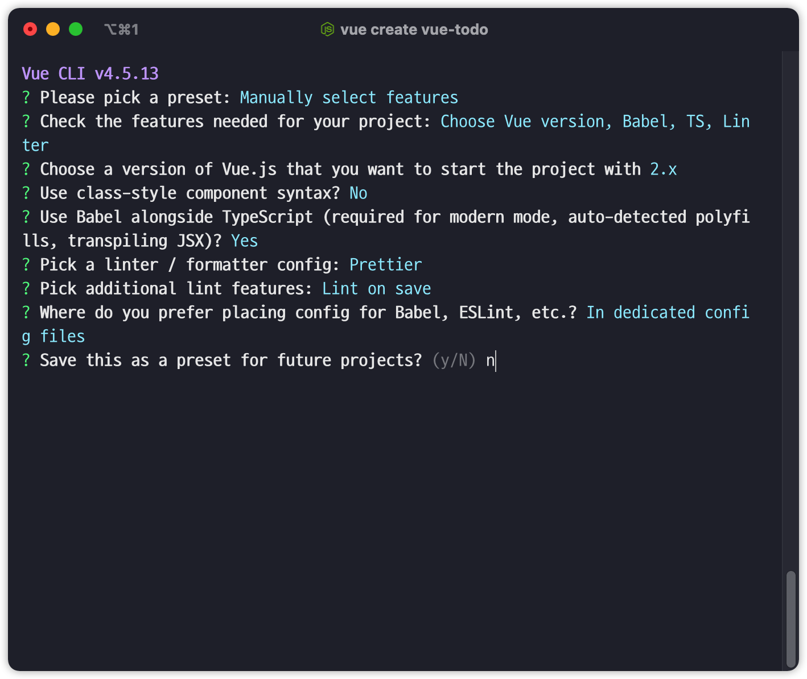

# vue-todo

## Project setup
```
yarn install
```

### Compiles and hot-reloads for development
```
yarn serve
```

### Compiles and minifies for production
```
yarn build
```

### Lints and fixes files
```
yarn lint
```

### Customize configuration
See [Configuration Reference](https://cli.vuejs.org/config/).


### 프로젝트 생성 ( Vue cli )




### 클래스 문법을 권장하지 않는 이유

- RFC(Request For Comment) 에서 Class API를 Drop한다는 이야기가 있음

- vue는 이제 setup() 안에서 옵션들이 제공됨 (필수는 아님)

- vue3이 나아가는 방향속에 클래스는 없음

  

---


`tsconfig.json`

- typescript의 설정 파일이기도 하면서, vs-code 내부적으로 타입을 인식해서 부가적인 기능도 제공.

```json
{
  "compilerOptions": {
    "target": "esnext",
    "module": "esnext",
    "strict": true,
    "jsx": "preserve",
    "importHelpers": true,
    "moduleResolution": "node",
    "skipLibCheck": true,
    "esModuleInterop": true,
    "allowSyntheticDefaultImports": true,
    "sourceMap": true,
    "baseUrl": ".",
    "types": [
      "webpack-env"
    ],
    "paths": {
      "@/*": [
        "src/*"
      ]
    },
    "lib": [
      "esnext",
      "dom",
      "dom.iterable",
      "scripthost"
    ]
  },
  "include": [
    "src/**/*.ts",
    "src/**/*.tsx",
    "src/**/*.vue",
    "tests/**/*.ts",
    "tests/**/*.tsx"
  ],
  "exclude": [
    "node_modules"
  ]
}
```

